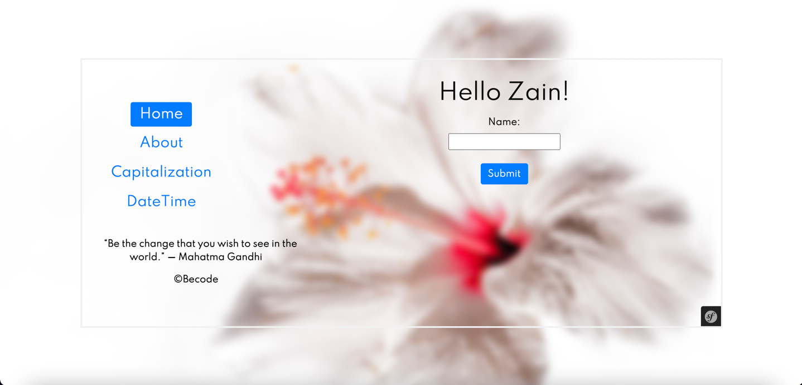

# Twig
- Team challenge : `solo`
- Duration: `1 day`
- Dated : `12 Jan 2022`🕓

### How it looks in browser👩🏻‍💻🎉



### Challenge
- How to add date functionality and modify the twig file.✔

- Basic styling stuff.✅

- How to add random quote generator for every page✅

## Must-have features
Use the MVC Routing exercise you created previously. If yours was unstable, ask another student to use theirs.✅

- Add a <footer>&copy; Becode</footer> in the base template file, this footer should appear on all pages!✅

### Menu
- in the base.html.twig file add a menu block surrounded by an ``<aside>`` tag (make it appear to the left with css).✔️
- Inside the menu block add 2 links to the homepage and the about me page.✔

### About me
Let add some content to the new left menu that only appears on the about-me page.✔
Show the current date in 3 different formats in the left menu, but only pass a `DateTime` object once through your controller.✔
Because your Controller is in a namespace don't forget to import the `DateTime` class! ✔

- Europe: DMY
- America: MDY
- China & Japan: YMD

Filters are really flexible, small modifiers you can assign to variables to change their appearance.✔

You will need a custom pattern for this, one example of this would be `{{ date|format_date(pattern="J/M/d") }}`.✔

In order to make this work you might need to install the following extensions:

`sudo apt-get install php-http`
`sudo apt-get install php-intl`
`composer require twig/intl-extra`


### Home page (show my name)
Now we add some extra functionality on the homepage, in the menu below the default navigation. ✔

Let show his name with each word capitalized, but all the rest in lower case, so "JOHN SMITH" becomes "John Smith". ✔


### Creating a custom twig helper
Sometimes you want to add a piece of custom code on several places in your website, and always passing the same code to your controller can become cumbersome. ✔
This is why we can extend with our custom twig functions and filters! ✔

We are going to create a "Random quote generator", you don't need to write the code for the quotes anymore.Add a random quote on each page below the current content. ✔

Make sure to show the enters ```(<br>)``` being displayed in the quotes, don't show a quote on only 1 line. ✔

## Finished 🥳