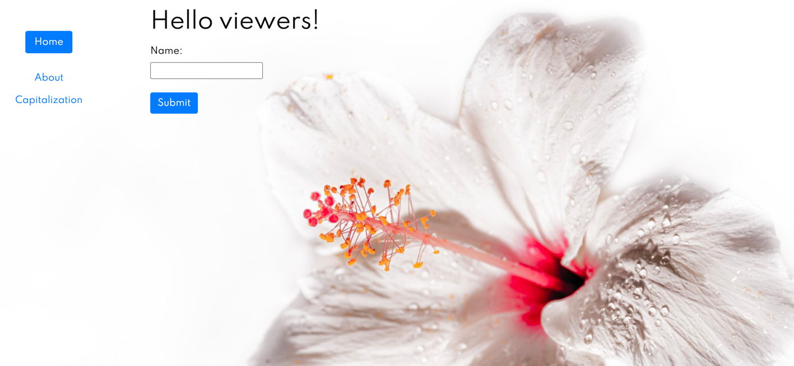

# Dependency Injection
- Team challenge : `solo` 
- Duration: `1 day`
- Dated : `11 Jan 2022`🕓 

### Challenge
💡Understand the value of a Dependency Injection Layer.✔

- Use the DI container inside Symfony.✅

- Knows how to configure services and dependencies✅

 ## Must have Features 🔗
### Step 1
1. Create an [interface](https://www.php.net/manual/en/language.oop5.interfaces.php) called `transform`, that requires one public method called `transform`.✅

1. Make a class which capitalizes every other letter in a string (eg: "hElLo WoRlD"). Implement the `transform` interface.✅

1. Make another class which changes all spaces to dashes "-" (eg: "hello-world-i-love-to-code"). Implement the `transform` interface.✅

1. Make a logger class which logs messages in a file called "log.info".✅

### Step 2
Now make a "master" class which accepts a user input (simple form with 1 field). It should do the following.
- You log the message✔️
- You echo it to the screen using the weird capitalization✔️

Reuse the classes you made inside the master class, but you should not use the keyword "new" inside the master class. Pass it to the constructor.✔️

### Step 3: Polymorphism
Add a dropdown with 2 options in your form (keep it simple, just an html dropdown will be enough for now). The 2 options are the names of the 2 classes you made that transform a string. Make it so that depending on the user input one transformation is applied. ✔️

**Do not change anything in your master class file!**

If you did the previous step correctly you should be able to change the behavior of the master class without having to change any code in the master class!✔️

This is a really powerful concept called **polymorphism**. It is made possible because both classes use **the same interface**, so they have the same function names: the code that uses this class does not care about which one it gets, as long as it has a function called `transform`. ✔️

In short: When two objects have the same interface, they are functionally interchangeable = polymorphism.✔️

## Screenshot

## Finished🎉